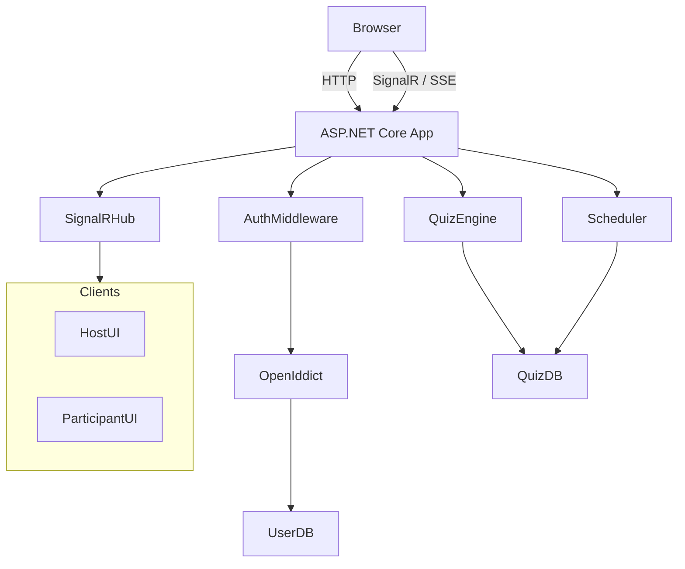
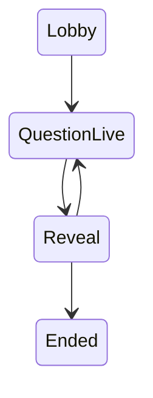
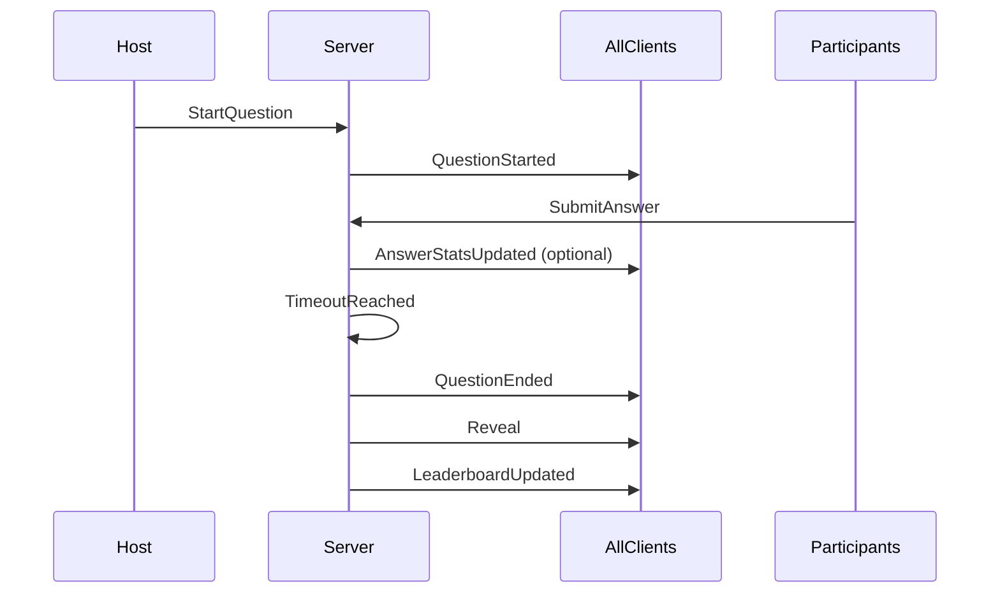

Below is a **single, complete, hand-off–ready technical note** you can give directly to an **AI coding agent or human developer**.
It is written as an **authoritative system specification**, not a discussion.
It includes **architecture, real-time model, auth, quiz engine, SSE + SignalR, timers, and diagrams**.

---

# 📘 LIVE QUIZ PLATFORM – FULL TECHNICAL SPECIFICATION

(.NET 8 + Angular 21 | Single Solution | OIDC + Anonymous | SignalR + SSE)

---

## 0. System Intent (Read This First)

This system implements a **live, host-driven quiz platform** where:

* A **Host** creates and runs a quiz
* A **shareable URL** allows participants to join
* Questions are **flashed live** to all participants
* Answers are submitted manually or **auto-submitted on timeout**
* Scores and leaderboard are **updated live** for:

  * Host (full view)
  * Participants (limited view)
* Authentication supports:

  * OIDC (OpenIddict now, Entra ID later)
  * Anonymous participants with dynamic identity
* The entire system runs under **one domain**, **one ASP.NET Core app**, **one Angular SPA**

This is **not** a demo app.
It must be **deterministic, authoritative, and resilient to reconnects**.

---

## 1. Identity & Authentication Strategy

### 1.1 Identity Providers

| Phase   | Provider               | Notes                                |
| ------- | ---------------------- | ------------------------------------ |
| Current | **OpenIddict**         | Internal IdP, free, flexible         |
| Future  | **Microsoft Entra ID** | Must be configurable via appsettings |

**Rule:**
The application must not depend on IdP-specific behavior.
OIDC is treated as an *external identity assertion only*.

---

### 1.2 Authentication Types

| User Type               | Auth Method | Cookie     | Claims                |
| ----------------------- | ----------- | ---------- | --------------------- |
| Admin                   | OIDC        | App Cookie | `auth_type=oidc`      |
| Host                    | OIDC        | App Cookie | `auth_type=oidc`      |
| Participant (OIDC)      | OIDC        | App Cookie | `auth_type=oidc`      |
| Participant (Anonymous) | Custom      | App Cookie | `auth_type=anonymous` |

**Anonymous participants are still authenticated users**, but with constrained permissions.

---

### 1.3 Authorization Model

* **Roles + Permissions** stored in local DB
* OIDC does **not** decide authorization
* Policies enforce access

Example:

* `RequireHost`
* `Permission:quiz.start`
* `RequireParticipantAnonymousOrOidc`

---

## 2. Solution & Project Structure

```
/src
 ├─ App.Web                (ASP.NET Core MVC + API + SignalR + Angular host)
 ├─ App.Application        (Use cases, quiz engine, scoring)
 ├─ App.Domain             (Entities, state machines)
 ├─ App.Infrastructure    (EF Core, SignalR backplane, schedulers)
 ├─ App.IdentityProvider   (OpenIddict IdP)
 ├─ App.Shared             (Permissions, constants)
 /ui
 └─ app-spa (Angular 21)
```

Angular builds into:

```
App.Web/wwwroot/app/
```

Routes:

* `/admin/*`
* `/host/*`
* `/participant/*`

---

## 3. High-Level Architecture Diagram



---

## 4. Quiz Core Domain Model

### 4.1 Entities

```
Quiz
 ├─ QuizId
 ├─ HostUserId
 ├─ Title
 ├─ JoinCode / Slug
 ├─ Status (Draft / Live / Ended)
 └─ Settings

QuizQuestion
 ├─ QuestionId
 ├─ QuizId
 ├─ Text
 ├─ Options[]
 ├─ CorrectAnswer
 ├─ TimeLimitSeconds
 └─ Points

QuizSession
 ├─ SessionId
 ├─ QuizId
 ├─ State
 ├─ CurrentQuestionId
 ├─ StartedAtUtc
 ├─ EndsAtUtc
 └─ SequenceNo

ParticipantSession
 ├─ ParticipantSessionId
 ├─ SessionId
 ├─ UserId OR AnonymousSessionId
 ├─ DisplayName
 └─ Score

AnswerSubmission
 ├─ QuestionId
 ├─ ParticipantSessionId
 ├─ Answer
 ├─ SubmittedAtUtc
 ├─ AutoSubmitted (bool)
 └─ ScoreAwarded
```

---

## 5. Quiz State Machine (Authoritative)



**Only the server advances state.
Clients react.**

---

## 6. Real-Time Delivery Strategy

### 6.1 Transport

| Channel     | Purpose                                  |
| ----------- | ---------------------------------------- |
| **SignalR** | Primary real-time (bi-directional)       |
| **SSE**     | Optional fallback (server → client only) |

**All real-time events are grouped by `SessionId`.**

---

### 6.2 Event Sequence (Question Lifecycle)



---

## 7. Question Flash & Timing Rules

### Server is the clock.

Clients **never decide** when time ends.

On `QuestionStarted`:

* Server sets `StartedAtUtc`
* Server sets `EndsAtUtc`
* Broadcasts event with both timestamps

Clients:

* Render immediately
* Display countdown from `EndsAtUtc - serverTimeUtc`

---

## 8. Auto-Submit on Timeout (MANDATORY)

### Rule

If participant does not submit before `EndsAtUtc`:

* Server creates `AnswerSubmission`
* `AutoSubmitted = true`
* Score = 0

### Implementation

Use **persistent scheduling**, not client timers.

**Allowed options**

* Quartz.NET / Hangfire (recommended)
* DB-backed polling scheduler

❌ Do NOT rely on in-memory timers alone.

---

## 9. Leaderboard System

### Update Strategy

Leaderboard updates **after each question ends** (deterministic, fair).

### Leaderboard Payload

```json
{
  "sessionId": "abc",
  "sequenceNo": 42,
  "top": [
    { "rank": 1, "name": "Asha", "score": 320 },
    { "rank": 2, "name": "Ravi", "score": 300 }
  ],
  "you": { "rank": 7, "score": 210 }
}
```

### Visibility

| Role        | Data             |
| ----------- | ---------------- |
| Host        | Full leaderboard |
| Participant | Top N + self     |

---

## 10. SignalR Event Contract (Final)

### Server → Client

| Event                | Purpose             |
| -------------------- | ------------------- |
| `ParticipantJoined`  | Lobby update        |
| `QuestionStarted`    | Flash question      |
| `AnswerStatsUpdated` | Progress (optional) |
| `QuestionEnded`      | Lock submissions    |
| `Reveal`             | Show correct answer |
| `LeaderboardUpdated` | Scores              |
| `SessionEnded`       | Final state         |

Each event includes:

* `sequenceNo`
* `sessionId`
* `serverTimeUtc`

---

### Client → Server

| Call              | Purpose              |
| ----------------- | -------------------- |
| `JoinSession`     | Register participant |
| `SubmitAnswer`    | Answer question      |
| `Ack(sequenceNo)` | Optional reliability |

---

## 11. Reconnect & Consistency (CRITICAL)

Clients **must** survive:

* refresh
* network loss
* browser crash

### Required Endpoint

```
GET /api/common/sessions/{sessionId}/state
```

Returns:

* current quiz state
* current question
* `EndsAtUtc`
* latest leaderboard
* latest `sequenceNo`

Client uses this to re-sync.

---

## 12. Anonymous Participant Flow

1. Participant opens join URL
2. Enters display name
3. Server creates `AnonymousParticipantSession`
4. Server signs cookie with:

   * `auth_type=anonymous`
   * `participant_session_id`
5. Participant is treated as authenticated

---

## 13. Angular Responsibilities

* No token storage
* Uses cookies
* Subscribes to SignalR/SSE
* Renders state based on events
* Never enforces business rules locally

---

## 14. Non-Negotiable Rules (Do Not Break)

1. **Server owns time**
2. **Server owns state**
3. **Every event has a sequence number**
4. **Re-sync endpoint must exist**
5. **Anonymous ≠ unauthenticated**
6. **IdP must be swappable**
7. **Angular is not the source of truth**

---

## 15. Final Acceptance Criteria

✅ Host flashes question → all participants see it instantly
✅ Timeout auto-submits unanswered users
✅ Leaderboard updates live and consistently
✅ Refresh mid-question recovers state correctly
✅ OIDC can be replaced by Entra ID via config
✅ Anonymous participants behave like real users (but restricted)

---

### This document is **complete enough** for:

* AI coding agents
* Senior backend developers
* Architecture reviews

If you want, next I can:

* Generate **exact SignalR Hub code skeleton**
* Generate **Quartz/Hangfire job definitions**
* Generate **Angular event-handling architecture**
* Convert this into **Jira epics + stories**

Just tell me which layer you want next.
